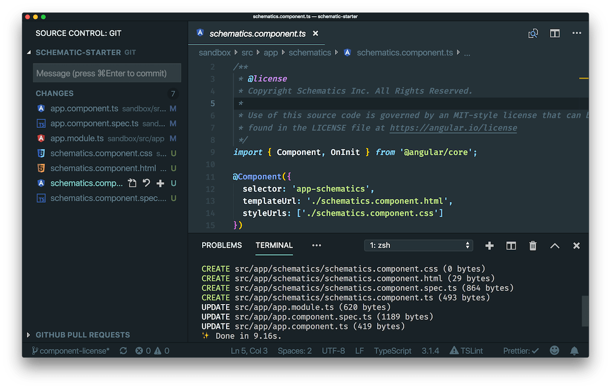
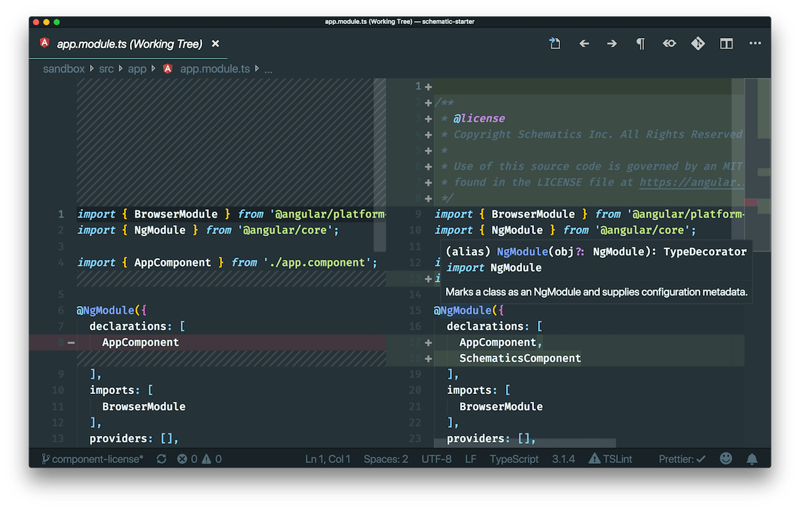

# Testing Schematics

When it comes to testing schematics, unit tests are often the method of choice. These are valuable and provide the benefits that unit tests generally do. They’re fast, isolated, easy to mock, and can provide a quick feedback loop.

When it comes to E2E tests, the conversations start to vary. Generally speaking, it’s not uncommon to hear E2E tests being described as brittle, slow, and requires more setup than unit tests. Libraries like [Cypress](https://www.cypress.io/) and a better understanding of what to test go a long way to fixing these issues but that’s another conversation altogether 🙂.

I mention E2E tests because underneath all the “negatives” I just discussed, they're extremely accurate ways to test applications. No simulations, no mocking, no configs. Just the code executing in its targeted environment.

If you’ve developed a schematic before you’ve probably reached a point where you’d like to test your code against a real Angular application. Ideally, it would be nice to do this repeatedly as you develop each new feature. Even better, before each release, you could run your schematic against a real Angular application and assert that the functionality exists and that it didn’t break anything in the process.

I ran into those needs when I started writing schematics and came up with a way to achieve all those things in a fairly simple way. I call it the Sandbox and you can find a starter project with it **[here](https://github.com/schuchard/schematic-starter)**.

# The Sandbox

Adding a sandbox solves allows you to repeatedly run the schematic against an Angular app. With a few scripts, you can run these as fast as than unit tests and easily see a diff of what your schematic did. You can also run them programmatically, like as part of your `test` script before a release.

## Architecture overview

The sandbox will be a version-controlled sibling app that you’ll run your schematic against through npm/yarn linking.

```bash
•
├── sandbox
│   └── angular-app/
├── src
│   ├── schematic
│   └── collection.json
└── package.json
```

## Version control

Placing the sandbox inside the schematic repo provides a lot of benefits.

- Everyone develops against the same target app, or apps if you configure more than one.
- Once you execute the schematic, it’s trivial to see a diff of the changes in your editor. This is the number one benefit and my initial goal when I start trying to solve this problem.



- With a short git command that I’ll show soon, we can easily reset the state of the sandbox and re-run the schematic. This gives you the short feedback loop. Make a change, run the schematic, visually assert, clean the sandbox, repeat.
- Since this is part of the repo, you can tie this into an automated release process where the schematic is tested against the sandbox, assertions are made, and the release is published.

# Adding a sandbox

First, add a sibling `./sandbox` directory next to your schematic `./src` directory. Inside you can create whatever type of application you expect your schematic to run against. I generally run `ng new` in the sandbox but have also configured an app with more specific files/folders/features to aid in testing.

You can also configure multiple sandboxes but I won’t be covering that. If that’s something you’d like, you’ll need to refactor your scripts to run against each sandbox. We’ll cover the scripts below.

## Sandbox modifications

If you’re just running `ng new` inside the sandbox I generally make two changes to the sandbox `scripts` in the `package.json`. I use both of these commands when testing the sandbox

```json
"build": "ng build --prod --progress=false",
"test": "ng test --watch=false"
```

# Add scripts

Once you’ve added the sandbox app, the rest of the configuration lies in how you orchestrate the schematic and the sandbox.

For these commands, I’m going to reference [yarn](https://yarnpkg.com/en/), which is similar to [npm](https://docs.npmjs.com/getting-started/what-is-npm) but a little more concise when running scripts. If you prefer npm, replace the `yarn` scripts with `npm run`.

Here are the final scripts you’ll need in the schematics `package.json` file.

```json
"scripts": {
    "build": "tsc -p tsconfig.json",
    "clean": "git checkout HEAD -- sandbox && git clean -f -d sandbox",
    "launch": "cd sandbox && ng g schematic-collection:schematic-name",
    "clean:launch": "yarn clean && yarn launch",
    "build:clean:launch": "yarn build && yarn clean:launch",
    "test": "yarn build:clean:launch && yarn test:sandbox && yarn clean",
    "test:sandbox": "cd sandbox && yarn lint && yarn test && yarn e2e && yarn build",
    "link:schematic": "yarn link && cd sandbox && yarn link schematic-collection",
    "publish": "yarn test && PUBLISH_CMD"
}
```

## Build the schematic

You may already have this script but for this post, we’ll assume that your script to `build` the schematic is as follows. This will compile the Typescript files to Javascript.

```json
"build": "tsc -p tsconfig.json"
```

## Clean up

Let’s start with resting the sandbox before we start executing the schematic. Add a `clean` script that resets the sandbox to the version-controlled state.

```json
"clean": "git checkout HEAD -- sandbox && git clean -f -d sandbox"
```

## Link the sandbox

This sandbox pattern only works if we can execute the schematic locally against another local application. The link schematic script will create a symlink to your global package directory under the `package.json['name']` value. Then we’ll `cd` into the sandbox and link to that package name. Now, whenever that package is requested in the sandbox it will execute the code one directory up in `./src`. Once you run the schematic against the sandbox, you can view this “linking” by looking in the sandbox’s `node_modules` under to schematic package name.

```json
"link:schematic": "yarn link && cd sandbox && yarn link schematic-collection"
```

## Run the schematic

Next, let’s configure how we’ll test the schematic against the sandbox. First, we’ll create the script to run the schematic which we’ll reuse later. The script will `cd` into the sandbox and run the `generate` command from the Angular CLI. You can pass any options your schematic requires if necessary. If you’re taking advantage of Schematic [prompts](https://www.kevinschuchard.com/blog/2018-10-22-angular-cli-prompts/) you can inline the options to avoid bring prompted and create a separate launch script to test the prompts without inlined options.

```json
"launch": "cd sandbox && ng g schematic-collection:schematic-name"
```

### Avoid CLI prompts with inline options

```json
"launch": "cd sandbox && ng g schematic-collection:schematic-name --name=hello"
```

Now that we have our `launch` command lets create a script that resets the sandbox before running the schematic. We’ll combine two scripts that we’ve made so far. This is helpful when you need to rerun the schematic without changing the schematic code.

```json
"clean:launch": "yarn clean && yarn launch"
```

Finally, a common command you’ll likely use will build the schematic, reset the sandbox, and run the schematic in the sandbox.

```json
"build:clean:launch": "yarn build && yarn clean:launch"
```

You can also pass options to the wrapped `launch` command by appending them

```bash
yarn build:clean:launch --name=hello
```

## Testing

So far we’ve configured how to build, clean, and run our schematic. This provides us with the ability to visually see what our schematic is doing against the sandbox application. But we can improve this further. For example, after our schematic runs, it might be a good idea to make sure the app still operates normally. One way to test this could be to run `ng {test, e2e, lint, build}` in the sandbox application.

To do that let’s create a script that’s similar to what we did with `launch`.

```json
"test:sandbox": "cd sandbox && yarn lint && yarn test && yarn e2e && yarn build"
```

Next let’s wrap up some additional functionality into a single script. Here we’ll do a `build`, `clean`, and `launch`. Then we’ll run the tests we specified in `test:sandbox` and finally we’ll reset the sandbox after the test in case we’re running this locally with `clean`.

```json
"test": "yarn build:clean:launch && yarn test:sandbox && yarn clean"
```

Now we have a single script to test our Schematic end to end. This is useful if you have a release process that runs test(s) before publishing. Now you can rely on this script to pass/fail your release and you’re on your way to CI/CD bliss. 🙂

## Publishing

Eventually, you’re going to want to publish your schematic for the world to use. Fortunately, we’ve added the functionality to develop faster and with better confidence by being able to see what our schematic is doing. We’ve also orchestrated our scripts in a way that makes it trivial to confidently publish our schematic. Although everyone’s publishing needs vary, it’s now easy to configure a publishing script.

```json
"publish": "yarn test && PUBLISH_CMD"
```

# Additional Configuration

## Schematic names

Schematic projects are capable of containing a collection of schematics. Which is why you can call your schematic like

```bash
ng g schematic-collection:schematic-name
```

In the schematic `.src/SCHEMATIC/collection.json` you can configure the public API of your schematic code. Specifying properties in the `schematics` object will make them available after the `:` from the example above.

```json{4,9,14}
{
    "$schema": "../node_modules/@angular-devkit/schematics/collection-schema.json",
    "schematics": {
        "prettier": {
            "description": "AddsPrettier to the application.",
            "factory": "./prettier/index",
            "schema": "./prettier/schema.json"
        },
        "add": {
            "description": "AddsPrettier to the application.",
            "factory": "./prettier/index",
            "schema": "./prettier/schema.json"
        },
        "ng-add": {
            "description": "AddsPrettier to the application.",
            "factory": "./prettier/index",
            "schema": "./prettier/schema.json"
        }
    }
}
```

The following schematic names would be available with the above configuration

```bash
ng g @schuchard/prettier:add
```

```bash
ng g @schuchard/prettier:prettier
```

A special property name is `ng-add`. Specifying this property and pointing the `factory` to a schematic will allow a CLI consumer to access the schematic in this following manner.

```bash
ng add schematic-collection

# or

ng add @schuchard/prettier
```

Note that currently, `ng add` will execute the schematic and add it as a dependency of the application it’s run against.

# Helpful resources and links

Want to test out everything mentioned above? Fork this repo

- [https://github.com/schuchard/schematic-starter](https://github.com/schuchard/schematic-starter)

Just getting started with schematics? This is a great article to read.

- [https://blog.angular.io/schematics-an-introduction-dc1dfbc2a2b2](https://blog.angular.io/schematics-an-introduction-dc1dfbc2a2b2)

Looking for inspiration or guidance on writing schematics? The Angular CLI source code is an excellent resource.

- [https://github.com/angular/angular-cli/tree/master/packages/schematics/angular](https://github.com/angular/angular-cli/tree/master/packages/schematics/angular)

Here are a few schematics I’ve written that use the Sandbox testing approach. Note that some of the scripts are named slightly different as this process has evolved over time.

- [https://github.com/schuchard/prettier-schematic](https://github.com/schuchard/prettier-schematic)
- [https://github.com/briebug/ngrx-entity-schematic](https://github.com/briebug/ngrx-entity-schematic)
- [https://github.com/briebug/jest-schematic](https://github.com/briebug/jest-schematic)

Interested more in CLI prompts? I have an article on that as well.

- [https://www.kevinschuchard.com/blog/2018-10-22-angular-cli-prompts/](https://www.kevinschuchard.com/blog/2018-10-22-angular-cli-prompts/)